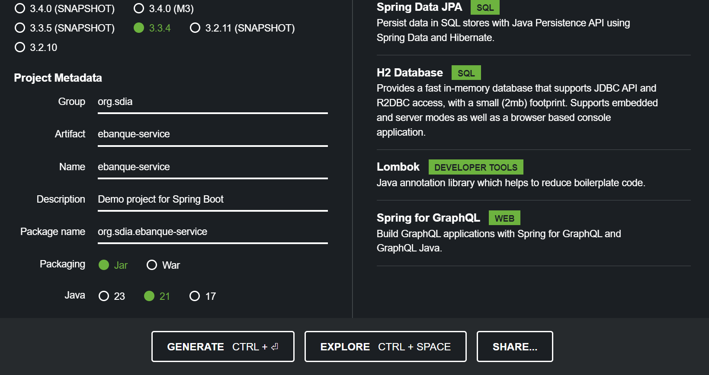
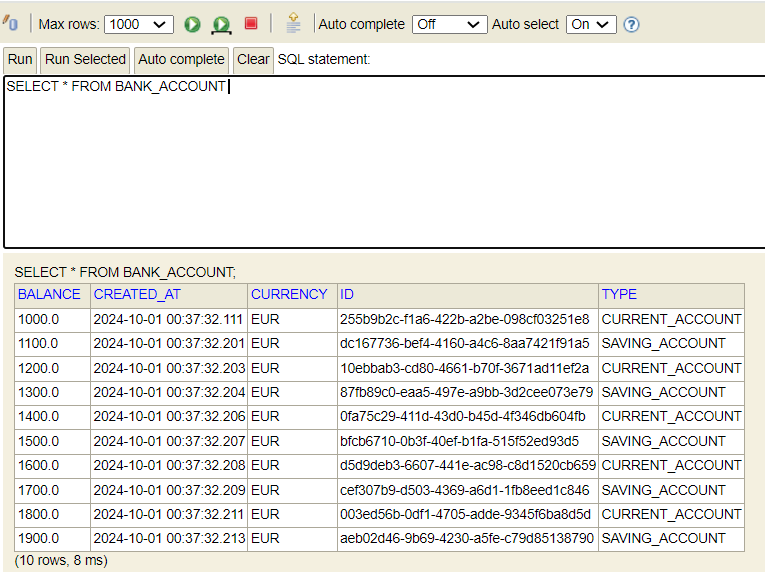

# Microservice de Gestion des Comptes Bancaires

Ce projet est un microservice développé avec Spring Boot permettant de gérer des comptes bancaires. Il intègre des services `RESTful` ainsi que des endpoints `GraphQL` pour effectuer des opérations liées aux comptes bancaires. Le microservice a été testé avec `Postman` et la documentation des API a été générée avec `Swagger`.

## Table des Matières
- [Fonctionnalités](#fonctionnalités)
- [Technologies Utilisées](#technologies-utilisées)
- [Instructions d'Installation](#instructions-dinstallation)
- [Utilisation](#utilisation)
- [Endpoints de l'API](#endpoints-de-lapi)
- [Utilisation de GraphQL](#utilisation-de-graphql)
- [Tests](#tests)
- [Captures d'Écran](#captures-décran)
- [Remarques](#remarques)
- [Licence](#licence)

## Fonctionnalités
- Services web RESTful pour la gestion des comptes bancaires.
- Opérations CRUD sur les comptes et les clients.
- Intégration de GraphQL pour gérer les requêtes et mutations.
- Base de données H2 en mémoire pour le développement et les tests.
- Documentation de l'API avec Swagger.
- Utilisation de projections pour limiter les champs retournés.

## Technologies Utilisées
- **Spring Boot**
- **Spring Data JPA**
- **H2 Database**
- **Lombok**
- **GraphQL**
- **Swagger**
- **Postman (pour les tests)**

## Instructions d'Installation

### 1. Créer un projet Spring Boot
Utilisez [start.spring.io](https://start.spring.io/) pour générer votre projet avec les dépendances suivantes :
- Spring Web
- Spring Data JPA
- H2 Database
- Lombok
- GraphQL

### 2. Exécution de l'application
Lancez l'application et accédez à la console H2 via l'URL : `http://localhost:8081/h2-console`. Indiquez le nom de la base de données spécifié dans `application.properties`.

